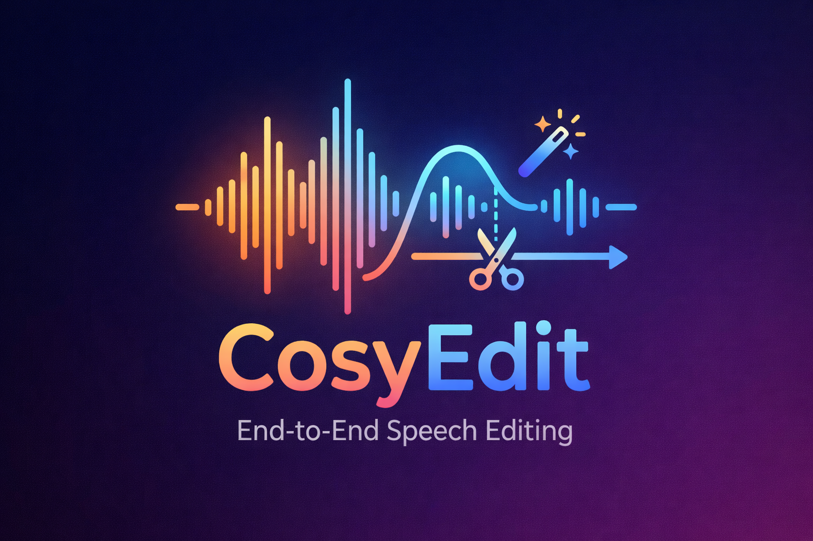

# CosyEdit: Unlocking End-to-End Speech Editing Capability from Zero-Shot Text-to-Speech Models

## Highlight 🔥

**CosyEdit** is an End-to-End Speech Editing model built upon the powerful **CosyVoice** zero-shot text-to-speech model.

<p align="center" style="margin-bottom:8px;">
    
</p>

<p align="center">
    <a href="https://cjy1018.github.io/CosyEditDemoPage/" target="_blank" >🎧 Demo Page</a>
    &nbsp;&nbsp;|&nbsp;&nbsp;
    <a href="https://arxiv.org/abs/2601.05329" target="_blank">📜 Paper</a>
    &nbsp;&nbsp;|&nbsp;&nbsp;
    <a href="https://huggingface.co/CJY/CosyEdit" target="_blank">🤗 HuggingFace</a>
    &nbsp;&nbsp;|&nbsp;&nbsp;
    <a href="https://www.modelscope.cn/models/CJY1018/CosyEdit" target="_blank">🤖 ModelScope</a>
</p>

### Key Advantages
- **Comfortable Speech Editing ☕**: No external speech–text alignment tools, no complex editing algorithms—everything is handled by an end-to-end model, just one-step editing.
- **Native Multi-Span Editing ✂️**: Natively supports insertion, deletion, and substitution across multiple spans within a single utterance, all completed in one inference pass.
- **Low-Cost, High-Performance ⚡**: Unlocks strong speech editing capabilities from existing zero-shot TTS models, delivering competitive performance with small model size and minimal training cost.


## Install

### Clone and Install

- Clone the repo
    ``` sh
    git clone --recursive https://github.com/CJY1018/CosyEdit.git
    # If you failed to clone the submodule due to network failures, please run the following command until success
    cd CosyEdit
    git submodule update --init --recursive
    ```

- Install Conda: please see https://docs.conda.io/en/latest/miniconda.html
- Create Conda env:

    ``` sh
    conda create -n cosyedit -y python=3.10
    conda activate cosyedit
    pip install -r requirements.txt -i https://mirrors.aliyun.com/pypi/simple/ --trusted-host=mirrors.aliyun.com

    # If you encounter sox compatibility issues
    # ubuntu
    sudo apt-get install sox libsox-dev
    # centos
    sudo yum install sox sox-devel
    ```

### Model Download

You can download the pretrained models by running the following code. The pretrained models will be saved in `pretrained_models` directory.

``` python
# modelscope SDK model download
from modelscope import snapshot_download
snapshot_download('CJY1018/CosyEdit', local_dir='pretrained_models/CosyEdit')

# for overseas users, huggingface SDK model download
from huggingface_hub import snapshot_download
snapshot_download('CJY/CosyEdit', local_dir='pretrained_models/CosyEdit')
```

### Basic Usage
Follow the code in `example.py` for detailed usage of CosyEdit.
```sh
python example.py
```

💡 CosyEdit is fully compatible with the CosyVoice codebase. This repository supports both speech editing with CosyEdit and speech synthesis using the original CosyVoice TTS models.


## Acknowledgments
We thank the following open-source projects for their support:

1. We borrowed a lot of code from [CosyVoice](https://github.com/FunAudioLLM/CosyVoice).
2. We borrowed a lot of code from [WeNet](https://github.com/wenet-e2e/wenet).

## Citations
If you find this work useful in your research, please consider citing our paper:

``` bibtex
@article{chen2026cosyedit,
  title={CosyEdit: Unlocking End-to-End Speech Editing Capability from Zero-Shot Text-to-Speech Models},
  author={Chen, Junyang and Jia, Yuhang and Wang, Hui and Zhou, Jiaming and Han, Yaxin and Feng, Mengying and Qin, Yong},
  journal={arXiv preprint arXiv:2601.05329},
  year={2026}
}
```

## Disclaimer
The content provided above is for academic purposes only and is intended to demonstrate technical capabilities. Some examples are sourced from the internet. If any content infringes on your rights, please contact us to request its removal.